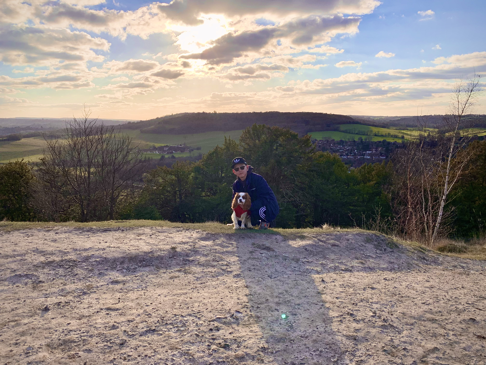

  

# Namaste 🙏 I'm Milan Limbu 👉 Certified CIPD Level 7 Professional
Attracting and Building World Class Talent 🚀 Senior Talent Partner @ [Form3](https://www.form3.tech/) 🕵

## Me, Myself and I 👋 🤪

TL;DR: Inherently curious, nerdy mind, ambivert by heart, always looking to learn and evolve beyond space, time and infinities

Coming approximately 4,572 miles🇳🇵 (what Google reckons...) from the Land of the Himalayas ⛰️, it has been one heck of a journey...🚶‍♂️

Ever since my uni days, I've always wanted a career that allowed me to really connect with people and manage the relationships involved. This is when I became really fascinated with my first recruitment job as it gave me all the hard exposure that I needed. However, feeling dubious & prosaic 💭 by the bizarre world of agency recruitment...I succumbed and came to an enlightenment that I wanted to work in an internal agile environment where businesses, candidates/clients rapport, core values can be built, managed and perpetuated in a qualitative way 🕴️

With over nearly 5 years’ experience in the tech recruitment sector (agency and internal), I’ve been fortunate enough to have worked within challenging and disruptive startup spaces (Biotech, Geotech and Fintech) with proven experience in delivering end to end ownership of Talent Management, Process Driven Quality Recruitment and Stakeholder Relations 🤓 Raised and graduated from Oxford UK, these criteria have been enhanced by Business Management (Bachelors) and HRM (Masters) studies and through a diverse, dynamic, and interdisciplinary work environment.

As a polyglot talent advocate, I'm also a tech agnostic recruiter that is really cross-functional and innovative when it comes to working across new areas of business function or technology. I'm also an ambivert in nature whilst being a geek at heart so I'm always versatile and adaptable when it comes to seeking and taking on new challenges that foster continuous growth and development 🚀

Outside work in my spare time, you can see me (not specifically in this order) contributing to charities, unconditionally loving my Cavalier King Charles puppy “Prince”, reading life sciences books, playing guitar, basketball, singing, watching cosmos documentaries and fictional movies such as LOTR, Hobbit etc...🤔

## If you are blooooooody good at spying people like me then here are the links🕵!
 

 
